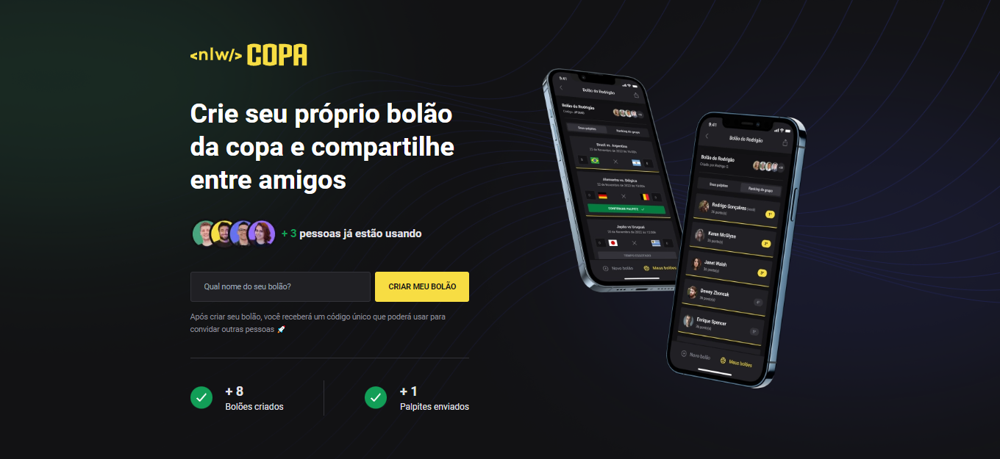
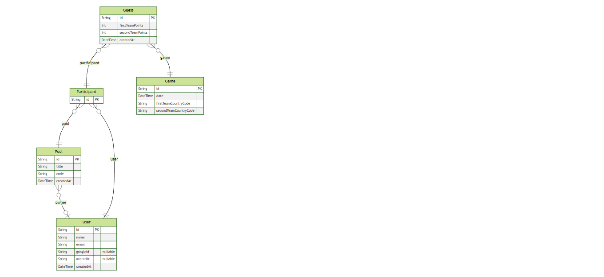
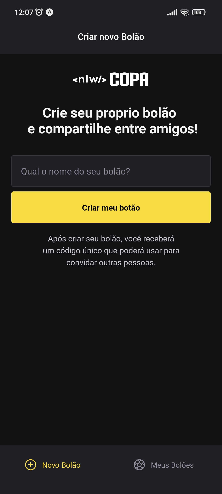
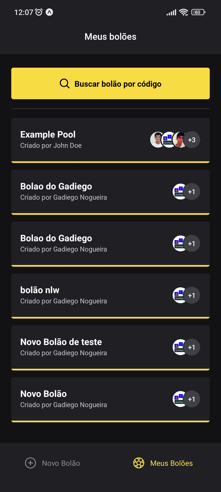
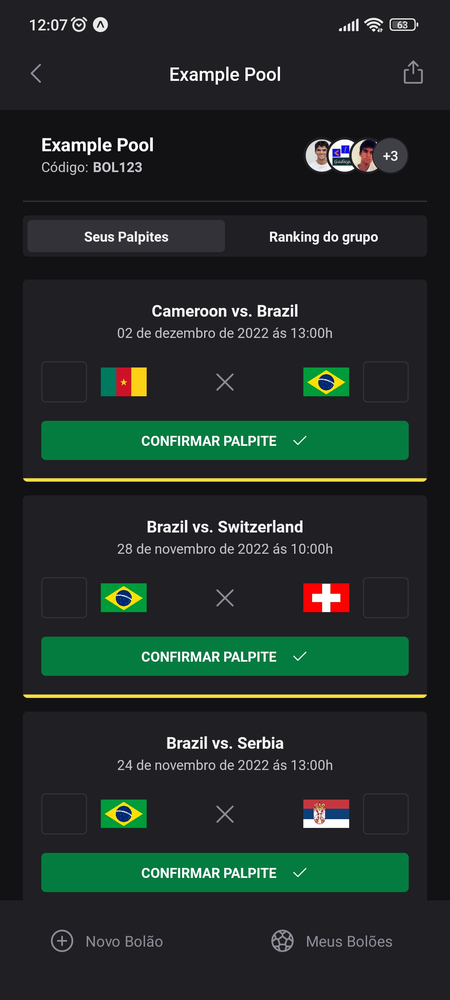
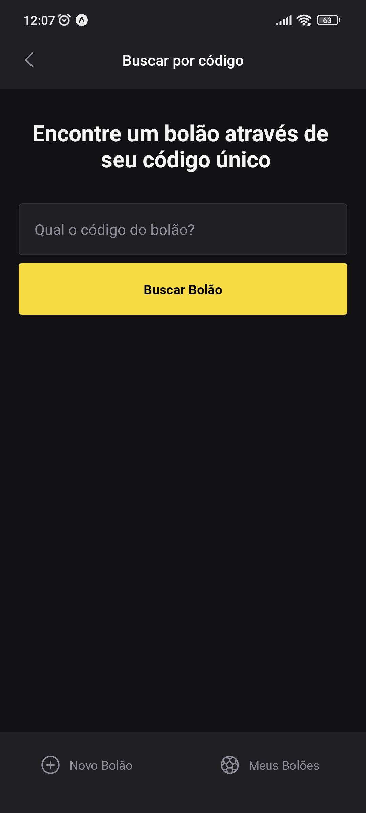

# NLW COPA

> Trilha Ignite  
Projeto desenvolvido no evento Next Level Week da Rocketseat.

## Tecnologias
    1. ReactJS 
        - Next / Tailwindcss / TypeScript
    2. React Native
        - Native base / TypeScript / Auth Session Google
    3. NodeJs
        - Prisma / SQLite / Prisma ERD / Fastify / zod / TypeScript

> ERD

> Prisma e SQLite 

> Mobile App

Este projeto não é mais mantido. Pode conter vulnerabilidades conhecidas. Não use em produção.

